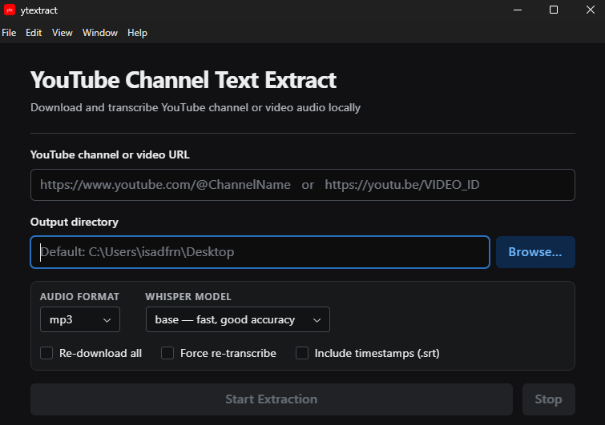

# YouTube Channel Text Extract




Download all videos from a YouTube channel as **audio only** (no video), then transcribe them to text locally with **OpenAI Whisper**. The text is ready for Claude, NotebookLM, or any text-based tool.

Available as both a **CLI tool** and a **desktop GUI application** (Windows, Linux, Mac).

## Project structure

```
youtube-channel-text-extract/
├── src/
│   └── ytextract/
│       ├── downloader.py      # download logic (yt-dlp)
│       ├── transcriber.py     # transcription logic (Whisper)
│       └── cli.py             # CLI entry point
├── desktop/                   # Electron desktop app
│   ├── package.json
│   ├── electron.vite.config.mjs
│   └── src/
│       ├── main/index.js      # Electron main process
│       ├── preload/index.js   # contextBridge API
│       └── renderer/src/App.jsx  # React + Radix UI frontend
└── pyproject.toml
```

---

## Requirements

- **Python 3.8+**
- **FFmpeg** — required for audio conversion and Whisper transcription. Must be on your PATH.
  - [FFmpeg download](https://ffmpeg.org/download.html)
- **Node.js 18+** — required for the desktop app only

---

## Python CLI setup

```bash
pip install -e .
```

This registers the `ytextract` command globally.

### Usage

```bash
ytextract "https://www.youtube.com/@ChannelName"
```

Accepted URL formats include:

- channel handles: `https://www.youtube.com/@ChannelName`
- channel/user URLs: `https://www.youtube.com/channel/...`, `.../user/...`, `.../c/...`
- playlists: `https://www.youtube.com/playlist?list=...`
- single videos: `https://www.youtube.com/watch?v=VIDEO_ID`, `https://youtu.be/VIDEO_ID`

Output is written to the user's Desktop by default:

```
~/Desktop/
└── ChannelName/
    ├── audio/            ← downloaded audio files
    ├── transcriptions/   ← .txt transcripts (one per audio file)
    └── downloaded.txt    ← yt-dlp archive
```

### Options

| Option               | Description                                                                 |
| -------------------- | --------------------------------------------------------------------------- |
| `-o`, `--output-dir` | Base directory for the channel folder (default: Desktop)                    |
| `-f`, `--format`     | Audio format: `mp3`, `m4a`, `opus`, `vorbis`, `wav` (default: `mp3`)        |
| `--no-archive`       | Do not use download archive; re-download all videos                         |
| `-m`, `--model`      | Whisper model: `tiny`, `base`, `small`, `medium`, `large` (default: `base`) |
| `--force`            | Re-transcribe even if `.txt` already exists                                 |
| `--with-timestamps`  | Also write `.srt` and `.segments.json` alongside each transcript            |
| `-q`, `--quiet`      | Less verbose output                                                         |

### CLI vs Desktop app options

The desktop app maps directly to these CLI flags:

| Desktop option            | CLI flag             |
| ------------------------- | -------------------- |
| Re-download all           | `--no-archive`       |
| Force re-transcribe       | `--force`            |
| Include timestamps (.srt) | `--with-timestamps`  |
| Audio format              | `-f`, `--format`     |
| Whisper model             | `-m`, `--model`      |
| Output directory          | `-o`, `--output-dir` |

Note: `-q`, `--quiet` is currently CLI-only.

---

## Desktop app setup

```bash
cd desktop
npm install
npm run dev
```

### Quick setup with Make (Windows)

If you have `make` available (for example via Git Bash), you can prepare everything from the project root:

```bash
make setup
make dev
```

Useful targets:

- `make check` — verify Python, pip, Node.js, npm, and FFmpeg
- `make setup-python` — install Python package/dependencies (`pip install -e .`)
- `make setup-desktop` — install desktop dependencies (`npm --prefix desktop install`)
- `make build` — build desktop bundles

### Quick setup with PowerShell (no make)

If you are using Windows PowerShell and do not have `make`:

```powershell
# from project root
python -m pip install -e .
npm --prefix desktop install
npm --prefix desktop run dev
```

Optional checks:

```powershell
python --version
node --version
npm --version
ffmpeg -version
```

The app opens automatically. To build a distributable:

```bash
npm run build
```

### Features

- **URL field** — paste a YouTube channel URL or a single video URL
- **Output directory** — browse or type a path; defaults to your Desktop
- **Format & model selectors** — choose audio format and Whisper model size
- **Options** — re-download all, force re-transcribe, include timestamps
- **Live log** — real-time output from yt-dlp and Whisper with colour coding
- **Stop button** — cancel a running extraction at any time
- **Open folder** — jump to the output folder in your file manager when done

The desktop app spawns the `ytextract` Python CLI as a subprocess. If `ytextract` is not installed, it falls back to running `python3 -m ytextract.cli` automatically (requires Python dependencies installed from `pyproject.toml`, e.g. `pip install -e .` in the project root).

---

## How it works

- **Download:** [yt-dlp](https://github.com/yt-dlp/yt-dlp) with `bestaudio` format — only the audio stream is fetched. FFmpeg converts to your chosen format.
- **Transcription:** [OpenAI Whisper](https://github.com/openai/whisper) runs on your machine and writes plain-text transcripts to the `transcriptions/` folder.

## Contributing

This repository is using [Gitflow Workflow](https://www.atlassian.com/git/tutorials/comparing-workflows/gitflow-workflow) and [Conventional Commits](https://www.conventionalcommits.org/en/v1.0.0/), so if you want to contribute:

- create a branch from develop branch;
- make your contributions;
- open a [Pull Request](https://docs.github.com/en/pull-requests/collaborating-with-pull-requests/proposing-changes-to-your-work-with-pull-requests/creating-a-pull-request) to develop branch;
- wait for discussion and future approval;

I thank you in advance for any contribution.

## Status

Maintaining

## License

[MIT](./LICENSE)
